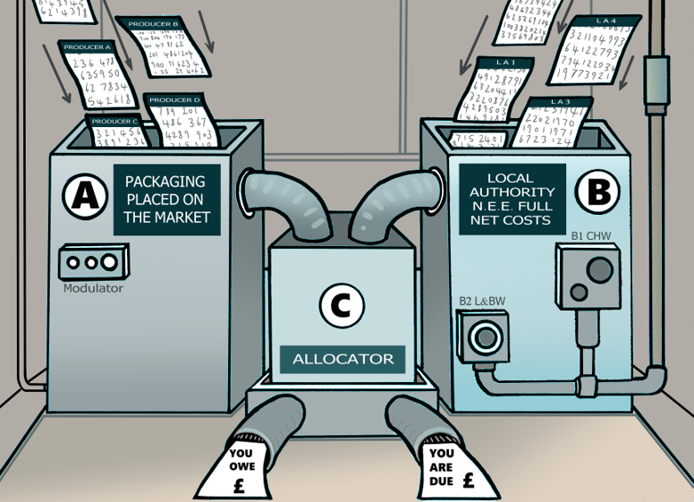

On this site you will find everything you need to be a happy and functioning member of the Fees and Payment Calculator modelling team.

Please suggest anything you think is missing from this site!

::: {style="display: flex; justify-content: space-around;"}
<figure style="text-align: center;">

<figcaption>New Starters!</figcaption>

</figure>

<figure style="text-align: center;">

<figcaption>LAPCAP Library</figcaption>

</figure>

<figure style="text-align: center;">

<figcaption>LAPCAP Handbook</figcaption>

</figure>
:::

## Quick Links

[How to Record an Assumption](lapcap_handbook.html#how_to_assumption)

[How to Change a Data Input](lapcap_handbook.html#how_to_data_input)

[How to Write a Unit Test](lapcap_handbook.html#how_to_unit_test)

[How to Pull Request](lapcap_handbook.html#how_to_pull_request)

[How to Code Review](lapcap_handbook.html#how_to_code_review)

[Common Problems](other_common_problems.html)
