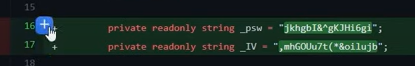
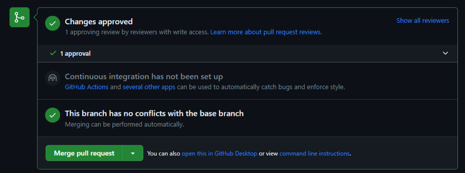

# LAPCAP Bible

# Documentation Overview

The below sets out the full set of documentation for LAPCAP, alongside where it can be found. In some cases, it may be stored in multiple locations and care should be taken to ensure both copies remain up to date.

In general, documentation should be kept as close to the code as possible, for ease of access. However, this may not always be possible.

## Overarching Documentation

|  |  |  |  |
|------------------|------------------|------------------|------------------|
|  | Description | Github Location | Sharepoint Location |
| Quality Assurance Plan | How, when and by whom model, data or assumption changes will be assured. | \- | [02 LAPCAP QA Plan.docx](https://defra.sharepoint.com/:w:/r/teams/Team1478/Extended%20Producer%20Responsibility%20for%20Packaging/07%20Fees%20and%20Payments%20Calculator/18%20Module%20B1%20-%20LA%20FNCs/04%20Bottom-up%20Modelling/00%20Model%20Master/02%20LAPCAP%20QA%20Plan.docx?d=w9c733b9d25d2431b9e9153384ad2352e&csf=1&web=1&e=c3uYng) |
| Signoff Log | Log of signoffs obtained for each version of LAPCAP. | \- | [03 LAPCAP Signoff Log](https://defra.sharepoint.com/:x:/r/teams/Team1478/_layouts/15/Doc.aspx?sourcedoc=%7B5065D966-5D34-493C-92E1-FCA1CE67B2FD%7D&file=TEMPLATE%20modulename%20assumptions_data_log1.xlsm&action=default&mobileredirect=true) |
| Template Assumptions Log | A blank version of our assumption log for use on any new modules. | \- | [04 TEMPLATE modulename assumptions_data_log.xlsm](https://defra.sharepoint.com/:x:/r/teams/Team1478/Extended%20Producer%20Responsibility%20for%20Packaging/07%20Fees%20and%20Payments%20Calculator/18%20Module%20B1%20-%20LA%20FNCs/04%20Bottom-up%20Modelling/00%20Model%20Master/04%20TEMPLATE%20modulename%20assumptions_data_log.xlsm?d=wb9cab66a483648f68e962eee10eb1add&csf=1&web=1&e=tL8AI4) |
| Team How To’s… | Describes practical steps required for various team processes. | [FPC Coding Guidance](https://defra-pepr-modelling-team.github.io/module_b_team_pages/index.html) | \- |

## Version Specific Documentation

In the [00 Model Master folder](https://defra.sharepoint.com/:f:/r/teams/Team1478/Extended%20Producer%20Responsibility%20for%20Packaging/07%20Fees%20and%20Payments%20Calculator/18%20Module%20B1%20-%20LA%20FNCs/04%20Bottom-up%20Modelling/00%20Model%20Master?csf=1&web=1&e=1jREhl), each model version will have a folder. This will contain all the documentation specific to that version.

Whilst the version is still under development this folder will have “- IN PROGRESS” appended to its name.

Once the version is completed (tagged on Github and merged into main), the folder will have the “- IN PROGRESS” label removed, a zip file of the code and a zip file of the data inputs saved into it and should not be edited from that point onwards.

Instead, a new “- IN PROGRESS” folder should be created, with below documents from the previous version copied into it, that can then be edited alongside changes to the code for the new version.

|  |  |  |  |
|------------------|------------------|------------------|------------------|
|  | Description | Github Location | Sharepoint Location |
| Technical Document |  |  |  |
| Assumptions Logs |  |  |  |
| Data Log |  |  |  |
| User Guide | Guidance on how to practically run and control LAPCAP. |  |  |
| Validation Docs | CAT WORKING ON |  |  |
| CHANGE LOG? | CAT INVESTIGATING IN VALIDATION TICKET |  |  |

# Modelling and Assurance Process

This document is a plan of how, when and by whom model, data or assumption changes will be assured. This includes a list of responsibilities relating to the model, who the model owner is, the governance structure and decision-making process supporting the model.

The below diagrams give an overview of the processes, with more detail included in later sections.

## Coding Process


## Signoff Process


## Stakeholder Groups

-   Senior Responsible Officers (SROs)
    -   Director of Resources & Waste (Emma Bourne) and equivalents in the Devolved Administrations (David McPhee, Rhodri Asby, Shane Doris).
-   pEPR Project Board
    -   Senior level oversight and support for the delivery of the joint UK-wide pEPR. Chaired by Dexter Davis.
-   Model Owner
    -   G6 head of Fees and Payments Calculator team (Tristan Ibrahim).
-   Advisory Groups
    -   Analytical Board - consists of senior analysts from England, Wales and Scotland
    -   Technical Working Group (TWG) - comprising expert waste advisors to Defra and the devolved administrations
    -   Local Authority Waste Officer Sounding Board – selected Waste Officers from local authorities across the UK
    -   Government Actuary’s Department – to date external QA has been provided by GAD
-   Fees and Payments Calculator modelling team
    -   Made up of members of the Government Operational Research profession, ensuring necessary modelling skills.

Named individuals correct as of 3/2/2025

# Coding Process Detail

## 1. Decide to change code

The modelling team, led by G7s, will identify the most important changes needed ahead of the next release of modelling outputs. They may choose to make use of the Analytical Board, TWG or Sounding Board in determining this. They may also choose to seek signoff of their plans from the model owner or project board, or to simply make them aware, to ensure planned changes are expected.

An agile methodology using Jira is then used to plan out the delivery of these changes.

## 2. Make changes to code

Through R Studio and Github changes are made to the existing LAPCAP model. This will be achieved through standard Git practice, e.g. branching off from the dev branch. Instructions for how to do this can be found in the [new starter section](new_induction_stuff.html).

The changes required should be clearly laid out in the relevant Jira ticket.

If the changes made involve adding, removing or changing an assumption, data import or code logic, then the modelling team member must update the relevant assumption log, data log or the technical document, code comments and roxygen headers, as well as including or updating unit tests.

The following sections explain how to do that:

> ### How to change an assumption {#how_to_assumption}
>
> 1.  Identify an assumption.
>
>     We define assumptions as **"choices analysts make to correct for low quality or absent data or information, that knowingly introduce inaccuracy into our outputs."**
>
>     Questions to help you determine whether a section of code is an assumption could be:
>
>     -   Have you had to make a specific choice for how to model?
>     -   Is your choice a simplification of reality?
>     -   Theoretically were there other choices you could have made?
>     -   Would changing your choice affect the final number?
>
>     ADD EXAMPLES?
>
>     NOT DATA INPUTS - COVERED BY DATA LOGS
>
>     NOT PROCEDURAL CHOICES (E.G. WHICH DPLYR FUNCTION TO USE) OR SUPER OBVIOUS STUFF THAT WOULD BE COVERED BY THE TECHNICAL DOC (E.G. WHAT COLUMNS OF A DATASET TO USE)
>
> 2.  Record your assumption in-code
>
>     Paste the following code snippet below the relevant portion of code and edit to reflect the above.
>
>     ```{r}
>         # Assumption: Title of assumption
>         # RAG: RED 
>         # Detailed description 
>         # on next line or many. 
>     ```
>
>     The title of the assumption should be short, clear and unique to this assumption.
>
>     The RAG rating is a red, amber or green rating summarising both the quality (e.g. how confident we are) and impact (e.g. how much model outputs are likely to be affected) of the assumption.
>
>     The detail description should give all information needed for someone to understand the assumption, including why an assumption is needed, why you have made the choice and more.
>
> 3.  Record your assumption in the relevant assumptions log
>
>     Each module has its own assumptions log which you can find via the Documentation Overview section above.
>
>     You will need to fill out the following fields:
>
>     -   ID *- prefilled*
>
>     -   Assumption title *- same as reported in code*
>
>     -   Detailed description *- same as reported in code*
>
>     -   Reporter *- your name*
>
>     -   Script(s) *- which R script the assumption can be found in*
>
>     -   Line(s) in code *- which lines in the script are relevant*
>
>     -   RAG *- same as reported in code*
>
>     -   RAG explanation *- an explanation for why you gave the above RAG rating*
>
>     -   Links to supporting evidence *- any supporting evidence that you used in formulating this assumption, which should be stored in the corresponding 'Supporting Evidence' folder*

> ### How to change an data input {#how_to_data_input}
>
> Data Pipeline
>
> -   The data pipeline should be run to update the data folder prior to a new version of the model being tagged (ensure to restart your R session and clean your environment before running the pipeline)
>
> -   Before the new version is tagged, you need to change the model_version parameter in the data pipeline and run it, and change the model_version parameter in run_LAPCAP_model, then push these changes before tagging the version
>
> -   If you are attempting to overwrite a folder then you will be asked to confirm – you should be sure that you want to overwrite the folder as this could prevent rolling back in the future
>
> -   Ensure that people are aware of a new version being tagged so they can rebase if necessary
>
> Versioning Vx.y.z
>
> -   The first number, x, should be updated when figures and published externally
>
> -   The second number, y, should be updated when figures are shared internally (e.g. Simpler Recycling)
>
> -   The third number, z, should be updated when there are changes to the data or data pipeline
>
> -   These versions should be tagged on dev on github to allow easy rollback to model versions
>
> -   When numbers are published externally and the first number updated, dev should be merged into main

> ### How to write a unit test {#how_to_unit_test}
>
> INSERT UNIT TEST INSTRUCTIONS

Locations for assumption log, data log or the technical document can be found in 01 Documentation Overview.docx, and each includes instructions for how to use it.

Once complete the modelling team member should make a pull request and request a review from another member of the team. The below template should be filled out when making a pull request:

> Replace this gif with one that describes how you felt about completing this ticket:
>
> 
>
> ✔️ **QA checklists**
>
> 📝 **Description of changes made:**
>
> 🎟️ **Link to Jira ticket:**
>
> 🤔 **Link to QA log (assumptions or data log), if changed:**
>
> 💾 **If appropriate, link to CSF markdown:**
>
> 📈 **If appropriate, link to output percentage change spreadsheet:**
>
> |                                 | \% change in EPR Total Net Cost |
> |---------------------------------|---------------------------------|
> | **Mean absolute change per LA** |                                 |
> | **Overall**                     |                                 |
> | **England**                     |                                 |
> | **Scotland**                    |                                 |
> | **Wales**                       |                                 |
> | **NI**                          |                                 |
>
> 🌜 **Do-er QA checklist**
>
> -   [ ] Before submitting a pull request the principle analyst **must** have completed the below checks.
>
> -   [ ] Assumptions log has been updated with any new or changed assumptions, including appropriate rationale and/or evidence
>
> -   [ ] Data log has been updated with any new or changed data
>
> -   [ ] If functional changes have been made to code, the CSF markdown has been generated and inspected, and there are no issues highlighted in visualisations
>
> -   [ ] If functional changes have been made to code, the percentage change in model outputs has been calculated and reported above, if the change is above threshold, this has been raised with a Grade 7 or above.
>
> -   [ ] If additional checks are required, these have been added to the Checker Checklist below, with detailed instructions as to how to run the checks

As mentioned in the final bullet you should also review the following additional checks and add to the Checker Checklist.

> **Additional checks**
>
> The below is a list of QA checks that you may want to perform in addition to the above. Note that this lists is **not exhaustive** and it is the responsibility of the principle analyst (do-er) and the QAer (checker) to ensure all items that need to be checked have been:
>
> 1\. Check that the calculations done are fit for purpose and are correct
>
> 2\. Check that uncertainty has been considered and appropriately accounted for (e.g. has sensitivity analysis been performed)
>
> 3\. Check that the data used is fit for purpose and the best option available to us
>
> 4\. Check that other appropriate documentation has been completed or updated to an appropriate standard e.g. the technical document
>
> 5\. Is the data being correctly pulled into the model?
>
> 6\. Is the data being properly cleaned and manipulated (either before the model or during the code)?
>
> 7\. Has the data been verified and validated? Has it been checked for potential errors? And has it been confirmed that the data appropriate to use in the first place? Is it the best possible option?
>
> 8\. Are there other results other than the outputs of the last model that the results need to be compared to?
>
> 9\. In cases where new data is added, or a change is heavily dependent upon a particular data source, does the model respond as expected to extreme values, negatives, zeroes, NAs etc? Is it possible to break the model with the data or generate impossible results?

The following explains the practicalities of making a pull request:

> ### How to make a pull request {#how_to_pull_request}
>
> Here are the **step-by-step instructions** to submit a pull request:
>
> 1.  Follow the steps on the 'How to edit Github code' to make the changes for your ticket
>
>     1.  Then go to the relevant repo on Github and navigate to your branch
>
>         a.  Use either the branches drop down or click on '*x branches*' to go to the branches page and select your branch.
>
>         
>
> 2.  If your push was recent there may be a pop up allowing you to '*compare and pull request*', if not then click '*Contribute*' and '*Open pull request*'.
>
>     
>
> 3.  Now check your pull request is set up correctly:
>
>     a.  Make sure you are merging to the correct branch, this will usually be *dev* (for code in development) or sometimes *main* if it has been fully quality assured.
>
>         
>
>     b.  Click '*Reviewer*' and select the person who has agreed to review your code.
>
>         
>
>     c.  Make sure you have completed the requirements and fill out the fields in the pull request template.
>
> 4.  Then you can click '*Create pull request*'.
>
>     a.  Once you have created the pull request you should move the ticket to 'For Review' on Jira.

## 3. Verify the changes

Once assigned a review the team member must complete the full checklist provided by the principle analyst. It is also the QAers must also review the list critically and ensure that it is both appropriate and sufficient. If the QAer feels otherwise they must raise this with in the first instance the principle analyst and then failing this the model owner.

You should use the checklist below, which is also included in the pull request template, to ensure you carry out all necessary checks:

> 🌛 **Checker QA checklist**
>
> Before approving a pull request the reviewer **must** have completed the below checks: In addition to the above, the following is a checklist for the reviewer to use:
>
> -   [ ] The "do-er" checklist has been completed to an appropriate standard, fields above the checklist have been appropriately completed
>
> -   [ ] Code meets the requirements set out in the Jira ticket
>
> -   [ ] All functions have roxygen headers with @description, @param and @return fields, and comments in code are appropriate and sufficient
>
> -   [ ] The code runs when using an empty R environment, without error
>
> -   [ ] Code follows the [tidyverse](https://style.tidyverse.org/) and [FPC style guide](https://defra-pepr-modelling-team.github.io/module_b_team_pages/index.html).
>
> -   [ ] No future risks have introduced by this change e.g. hardcoded values that may change in the future, or if they have they are adequately signposted and justified
>
> -   [ ] Code cannot be simplified significantly, there is no redundancy in code and no changes to model structure and dependant functions are needed, given the changes.
>
> -   [ ] There are no further improvements that can be made to the code
>
> -   [ ] Any additional QA checks appropriate to, and sufficient for, the changes have been performed
>
> -   [ ] When submitting the final review, a comment has been left that summarises the QA checks that have been performed and the outcomes

Also you should carry out any additional checks required, which have been added to the Checker Checklist by the doer.

Reviewers should trace the full logic of the code, both by reading through it and by running it and spot-checking intermediate data frames. They should inspect any relevant data imports both in R Studio and directly from their original source. They should examine model outputs before and after the changes to ensure they make sense. They should make sure they are able to replicate any processes or calculations in the code.

Reviewers should leave comments via GitHub, to ensure a record of verification and validation. GitHub has several features to help with this such as filtering changes by commit or file type, marking scripts as viewed, making direct code suggestions and bundling many comments into one review.

These reviews may go through one or more cycles of requesting changes, in order for the reviewer to be happy. GitHub has functionality to enable this.

The following explains the practical steps followed in when reviewing code:

> ### How to do a code review {#how_to_code_review}
>
> This [Github code review tutorial](https://www.youtube.com/watch?v=lSnbOtw4izI) shows you how to review a pull request, or you can follow the steps below.
>
> Follow these step-by-step instructions to do a proper code review:
>
> 1.  Navigate to the '*pull request*' that has been assigned to you. Read the description provided and use the checklist to aid your review.
>
> 2.  Switch to the '*Files changed*' tab to see the changes made, here you can make comments and suggestions as you see fit by clicking the blue plus to the left of the line you want to comment on.
>
>     
>
>     a.  Make sure to tick '*Start a review*' rather than '*Add single comment*'.
>     b.  Github has lots of functionality to make this process easier, including being able to mark scripts as '*Viewed*' and limiting changes to certain commits.
>     c.  You should also run the code in R Studio and check the relevant QA log has been updated.
>
> 3.  When you are ready click '*Finish your review*' add a summary comment and then click '*Submit review*'. You may choose to leave comments to be responded to, suggest changes to be made or simply approve the pull request straight away.
>
>     {width="311" height="222"}

## 4. Merge changes into dev branch

Before merging, the modelling team member should run the model. They should then add a set of outputs to the OUTPUT CHANGE LOG (RENAME), this ensures we are able to explain any changes in outputs from one publication to another.

TO ADD LINK TO OUTPUT CHANGE LOG (RENAME)

Once approved, changes should be merged into the dev branch. This may require resolving merge conflicts.

> #### How to merge
>
> 1.  Once your reviewer has inspected your code they may ask you some questions or suggest some changes. Once you have responded to these they will approve your pull request and you can merge your changes! This will look like:
>
>     
>
> 2.  You will need to check there are no 'merge conflicts'. This is where someone has changed the same files as you and so you need to agree with that person what are the correct changes and modify accordingly, Github will read '*Able to merge*' indicating there are no conflicts.
>
>     

# Signoff Process Detail

SIGNOFF LOG?

## 1. Model development complete

Once all changes required for a publication or sharing of the model are complete, the team will undertake the following steps.

Multiple pull requests will have been merged into dev (e.g. the above coding process will have been repeated multiple times) and these will all receive signoff together.

There are some circumstances where the full signoff may not be required for instance, sharing the model internally, this is left to the judgment of the model owner.

## 2. Model owner signoff

The model owner should sign off on the following documents, which should have been updated:

VALIDATION STUFF (PROCESS TBD)

VERIFICATION STUFF (PROCESS TBD)

CHANGE LOG (RENAME)

Technical Document

Assumptions Logs

Data Log (?)

The model owner does not necessarily have to review all of these themselves; they may utilise the advisory groups to offer assurance. For instance, in the past TWG have assured on assumptions logs.

The model owner’s signoff for that model version should be stored in SIGNOFF LOG (EMAIL EVIDENCE).

## 3. SRO signoff

Project board, acting on behalf of the model SROs, should signoff the model version for publication.

It is unlikely that members of project board will review any of the model or its documentation themselves, however copies should be shared so they have the option to, and can delegate to members of their organisation.

Instead, summaries of changes, visualisations of overall outputs and assurances from advisory groups may be presented. Exactly what is required may depend on the specific changes being signed off, so is left up to the judgment of the model owner.

There may be an additional stage of parameter setting, at this point in the approvals process, especially for the first outputs for each new year of EPR.

The project board signoff for that model version should be stored in SIGNOFF LOG (MEETING MINUTES AS EVIDENCE?).

## 4. Share or publish outputs

Merge into main

Save copy of everything in model master folder
