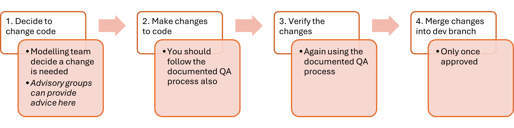
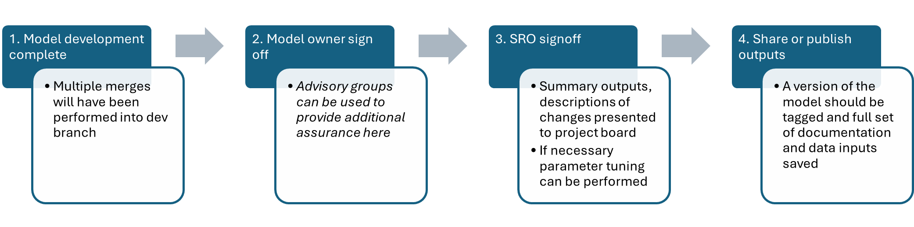
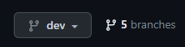
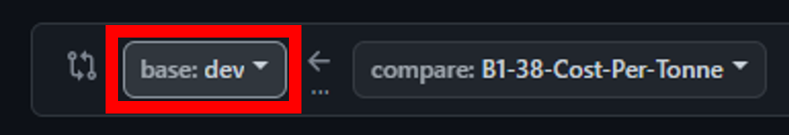
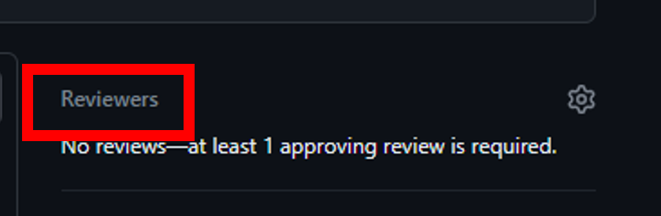
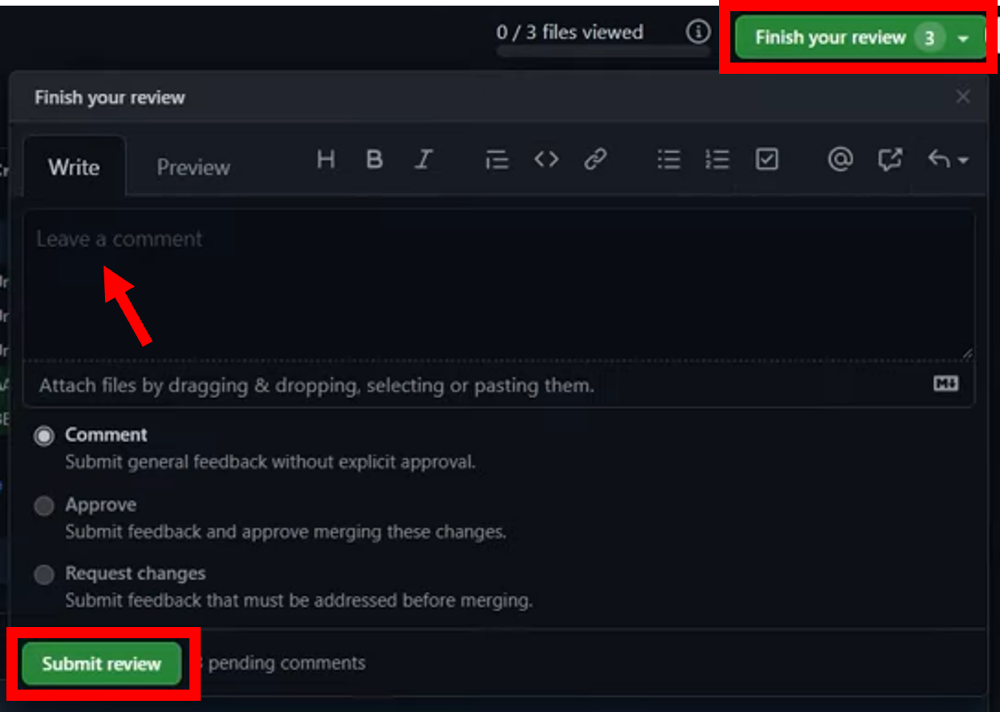
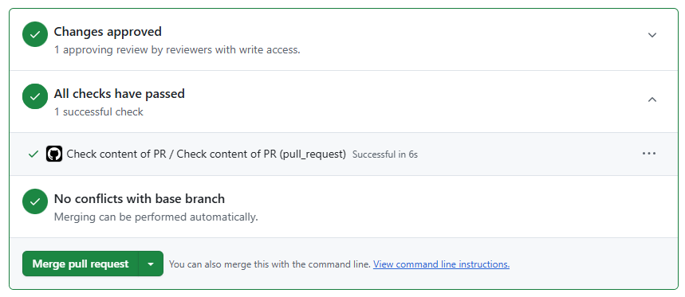
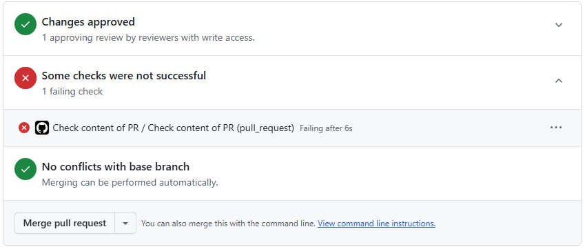
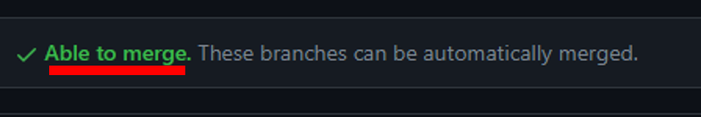

# LAPCAP Handbook

This document is a plan for model development, quality assurance and signoff processes of LAPCAP. It includes detail on how, when and by whom model, data or assumption changes will be assured. This includes a list of responsibilities relating to the model, who the model owner is, the governance structure and decision-making process supporting the model.

The below diagrams give an overview of the processes, with more detail included in later sections.

### Coding Process



### Signoff Process



### Stakeholder Groups

-   **Senior Responsible Officers (SROs)**
    -   Director of Resources & Waste (Emma Bourne) and equivalents in the Devolved Administrations (David McPhee, Rhodri Asby, Shane Doris).
-   **pEPR Project Board**
    -   Senior level oversight and support for the delivery of the joint UK-wide pEPR. Chaired by Dexter Davis.
-   **Model Owner**
    -   G6 head of Fees and Payments Calculator team (Tristan Ibrahim).
-   **Advisory Groups**
    -   Analytical Board - consists of senior analysts from England, Wales and Scotland
    -   Technical Working Group (TWG) - comprising expert waste advisors to Defra and the devolved administrations
    -   Local Authority Waste Officer Sounding Board – selected Waste Officers from local authorities across the UK
    -   Government Actuary’s Department – to date external QA has been provided by GAD
-   **Fees and Payments Calculator modelling team**
    -   Made up of members of the Government Operational Research profession, ensuring necessary modelling skills.

Named individuals correct as of 3/2/2025

### Model Versioning {#model_versioning}

We use a process of model versioning designed to allow easy rolling-back to past versions.

In version Vx.y.z

-   The first number, x, should be updated when figures are published externally (including publishing letters, use in public base fees etc.)
-   The second number, y, should be updated when figures are shared non-publically (e.g. with Simpler Recycling, MHCLG, DESNZ etc.)
-   The third number, z, should be updated when there are changes to the data inputs or the data pipeline (to allow rolling back to the correct data in the future)

> #### How to update the tagged version {#model_tagging}
> 
> When a new version of the model needs to be tagged on GitHub, follow the below steps:
> 
> 1.  Create a branch from dev
> 2.  Change the model_version parameter in run_LAPCAP_model (in main.R) and the model_version parameter in the data_pipeline function in update_data_pipeline.R. Commit and push these changes to your branch
> 3.  Run the data pipeline with the new model_version parameter to create a folder on the aws bucket containing all the data for that version of the model (remembering to restart your R session and clean your environment before running the pipeline) - see [here](#how_to_data_input) for full data pipeline guidance
> 4.  Ensure that the data pipeline and model both run with the new model_version parameter
> 5.  Open a pull request (PR) to merge your branch back into dev
> 6.  Merge the branch into dev (following any QA processes) and delete the now-redundant branch
> 7.  Tag the commit on dev with the new model version using GitHub's tagging feature
> 8.  Optionally, if publishing externally and updating the first number in the model version, you should now open a PR and merge dev into main
> 
> Ensure that the rest of the team are aware of the version being tagged so they can rebase their branches if necessary.


# Coding Process Detail

## 1. Decide to change code

The modelling team, led by G7s, will identify the most important changes needed ahead of the next release of modelling outputs.

They may choose to make use of the Analytical Board, TWG or Sounding Board in determining this.

They may also choose to seek signoff of their plans from the model owner or project board, or to simply make them aware, to ensure planned changes are expected.

An agile methodology using Jira is then used to plan out the delivery of these changes. Time for quality assurance should **ALWAYS** be built into each ticket in this planning, it should be understood that if there is not time for quality assurance then there is not time for the work.

## 2. Make changes to code

Through R Studio and Github changes are made to the existing LAPCAP model. This will be achieved through standard Git practice, e.g. branching off from the dev branch. Instructions for how to do this can be found in the [new starter section](new_induction_stuff.html).

The changes required should be clearly laid out in the relevant Jira ticket.

a.  If the changes involve adding, removing or changing an assumption then the modelling team member must update the relevant assumption log:


> ### How to change an assumption {#how_to_assumption}
>
> 1.  Identify an assumption.
>
>     We define assumptions as **"choices analysts make to correct for low quality or absent data or information, that knowingly introduce inaccuracy into our outputs."**
>
>     Questions to help you determine whether a section of code is an assumption could be:
>
>     -   Have you had to make a specific choice for how to model?
>     -   Is your choice a simplification of reality?
>     -   Theoretically were there other choices you could have made?
>     -   Would changing your choice affect the final number?
>     -   Is this information recorded elsewhere (e.g. in a data log or the technical document)?
>
> 2.  Record your assumption in-code
>
>     Paste the following code snippet below the relevant portion of code and edit to reflect the above.
>
>     ```{r}
>         # Assumption: Title of assumption
>         # RAG: RED 
>         # Detailed description 
>         # on next line or many. 
>     ```
>
>     The title of the assumption should be short, clear and unique to this assumption.
>
>     The RAG rating is a red, amber or green rating summarising both the quality (e.g. how confident we are) and impact (e.g. how much model outputs are likely to be affected) of the assumption.
>
>     The detail description should give all information needed for someone to understand the assumption, including why an assumption is needed, why you have made the choice and more.
>
> 3.  Record your assumption in the relevant assumptions log
>
>     Each module has its own assumptions log which you can find via the LAPCAP library.
>
>     You will need to fill out the following fields:
>
>     -   ID *- prefilled*
>
>     -   Assumption title *- same as reported in code*
>
>     -   Detailed description *- same as reported in code*
>
>     -   Reporter *- your name*
>
>     -   Script(s) *- which R script the assumption can be found in*
>
>     -   Line(s) in code *- which lines in the script are relevant*
>
>     -   RAG *- same as reported in code*
>
>     -   RAG explanation *- an explanation for why you gave the above RAG rating*
>
>     -   Links to supporting evidence *- any supporting evidence that you used in formulating this assumption, which should be stored in the corresponding 'Supporting Evidence' folder*

b.  If the changes involve updating a data import then the data pipeline must be refreshed and data logs updated:

> ### How to modify the data pipeline {#how_to_data_input}
>
> **Note:** When working on or updating the data pipeline itself (experimentation, testing, logic changes etc.) or updating/changing a data source, you should **ensure you have changed the model_version parameter in any calls to the data_pipeline function** -- this prevents you from accidentally overwriting data being used by the "live" model and ensures rolling-back to versions is easy in the future.
>
> The pipeline will tell you if you are going to overwrite any data.
>
> You should use a unique string for your model_version parameter e.g. "your_name_test".
>
> Once you have finished your experimentation/changes make sure to update the model_version parameter to the correct model version number before merging back into dev, and delete any temporary folders you created in aws using your model_version parameter. Follow the [Model Versioning guidance](#model_tagging) to update the model version and run the pipeline.
>
> #### **Running the Data Pipeline:**
>
> To run the data pipeline, run the update_data_pipeline.R script. This will update to the latest version of the LAPCAP package, load all of the pipeline scripts, and run the pipeline (including saving the outputs to the aws bucket). This will create a new folder of processed data at "Module_B1/Inputs/Processed/" named after the model_version parameter.
>
> There are dependencies between the sub-pipelines (e.g. waste flow using data from scheme data), so they will need to be run in order in any experimentation.
>
> If you are running pipeline functions outside of the pipeline itself, you will likely need to define the following variables:
>
> ```{r}
s3_bucket <- "s3-ranch-043"
root_folder <- "Module_B1/Inputs"
file_log <- list()
> ```
>
> #### **Updating the data pipeline itself:**
>
> 1. Follow the guidance above to prevent overwriting data that is (or will be) used
>
> 2. Experiment and make the changes needed to the code
>
> 3. Update the model_version parameter to the next model version (following the [Model Versioning guidance](#model_tagging)) in both the argument to data_pipeline() in update_data_pipeline.R and the argument to run_LAPCAP_model() in main.R
>
> 4. Run the pipeline to create a folder of data for that model version
>
> 5. Open a PR and merge your changes into dev
>
> 6. Follow the Model Versioning guidance about tagging the new model version on dev
>
> #### **Updating a data source:**
> 
> 1. Follow the guidance above to prevent overwriting data that is (or will be) used
>
> 2. Experiment and make the changes needed to the code. Ensure you add the file_path and file_log logic to any new import functions (see the other import functions for details) -- this will capture the new data sources in the file log.
>
> 3. Update the model_version parameter to the next model version (following the [Model Versioning guidance](#model_tagging)) in both the argument to data_pipeline() in update_data_pipeline.R and the argument to run_LAPCAP_model() in main.R
>
> 4. Run the pipeline to create a folder of data for that model version
>
> 5. Open a PR and merge your changes into dev
>
> 6. Follow the Model Versioning guidance about tagging the new model version on dev


c.  If model logic is changed then the technical document, code comments and roxygen headers must be updated accordingly.

    Additionally unit tests may need adding or updating.

> ### How to update the technical document
>
> MARCUS TO WRITE?

> ### How to write a unit test {#how_to_unit_test}
>
> NONO WRITING

c.  If the changes result in a functional change to the model, i.e. the changes will effect model outputs, then validation checks must be carried out.

> ### How to run validation checks {#how_to_validate}
>
> 1.  Check the percentage difference between the outputs from the last tagged version of LAPCAP and the output of whatever changes you have made
>
>     Use the spreadsheet "[model_version] model output sensitivity testing.xlsx" on the Module B1 Sharepoint, within [00 Model Master folder](https://defra.sharepoint.com/:f:/r/teams/Team1478/Extended%20Producer%20Responsibility%20for%20Packaging/07%20Fees%20and%20Payments%20Calculator/18%20Module%20B1%20-%20LA%20FNCs/04%20Bottom-up%20Modelling/00%20Model%20Master?csf=1&web=1&e=1jREhl) \> [model_version]
>
>     Follow the instructions in the first sheet.
>
>     The spreadsheet automatically highlights any percentage changes above the acceptable threshold. If values become highlighted, make sure to check with a Grade 7 whether the need for the change justifies the change in outputs.
>
> 2.  Generate and inspect the Critical Success Factors (CSF) markdown to ensure the change hasn't violated any of the success factors
>
>     Use the function generate_validation_markdowns() in documents in the LAPCAP repo to generate the markdown, following the instructions in the function's roxygen header
>
>     Inspect the output, ensuring that each CSF is still being met. If you have any concerns, raise them with a G7 or above.
>
>     Download a version of the output so you can link it in the pull request template later.

Locations for assumption log, data log or the technical document can be found in the LAPCAP library, and each includes instructions for how to use it.

> ### How to make a pull request {#how_to_pull_request}
>
> Once the modelling team member has completed their changes, they should make a pull request and request a review from another member of the team.
>
> Here are the **step-by-step instructions** to submit a pull request:
>
> 1.  Go to the relevant repo on Github and navigate to your branch
>
>     a.  Use either the branches drop down or click on '*x branches*' to go to the branches page and select your branch.
>
>         
>
> 2.  If your push was recent there may be a pop up allowing you to '*compare and pull request*', if not then click '*Contribute*' and '*Open pull request*'.
>
>     
>
> 3.  Now check your pull request is set up correctly:
>
>     a.  Make sure you are merging to the correct branch, this will usually be *dev* (for code in development) or sometimes *main* if it has been fully quality assured.
>
>         
>
>     b.  Fill out the pull request template (following carrying out validation checks, see below), including adding any additional QA checks to the list.
>
>         Replace this gif with one that describes how you felt about completing this ticket:
>
>         
>
>         ✔️ **QA checklists**
>
>         📝 **Description of changes made:**
>
>         🎟️ **Link to Jira ticket:**
>
>         🤔 **Link to QA log (assumptions or data log), if changed:**
>
>         💾 **If appropriate, link to CSF markdown:**
>
>         📈 **If appropriate, link to output percentage change spreadsheet:**
>
>         |                                 | \% change in EPR Total Net Cost |
>         |---------------------------------|---------------------------------|
>         | **Mean absolute change per LA** |                                 |
>         | **Overall**                     |                                 |
>         | **England**                     |                                 |
>         | **Scotland**                    |                                 |
>         | **Wales**                       |                                 |
>         | **NI**                          |                                 |
>
>         🌜 **Do-er QA checklist**
>
>         Before submitting a pull request the principle analyst **must** have completed the below checks.
>
>         -   [ ] Assumptions log has been updated with any new or changed assumptions, including appropriate rationale and/or evidence
>         -   [ ] Data log has been updated with any new or changed data
>         -   [ ] If functional changes have been made to code, the CSF markdown has been generated and inspected, and there are no issues highlighted in visualisations
>         -   [ ] If functional changes have been made to code, the percentage change in model outputs has been calculated and reported above, if the change is above threshold, this has been raised with a Grade 7 or above.
>         -   [ ] If additional checks are required, these have been added to the Checker Checklist below, with detailed instructions as to how to run the checks
>
>     c.  Click '*Reviewer*' and select the person who has agreed to review your code.
>
>         
>
>     d.  Make sure you have completed the requirements and fill out the fields in the pull request template.
>
> 4.  Then you can click '*Create pull request*'.
>
>     a.  Once you have created the pull request you should move the ticket to 'For Review' on Jira.

## 3. Verify the changes

Once assigned a review the team member must complete the full checklist provided by the principle analyst. It is also the QAers must also review the list critically and ensure that it is both appropriate and sufficient. If the QAer feels otherwise they must raise this with in the first instance the principle analyst and then failing this the model owner.

You should use the checklist below, which is also included in the pull request template, to ensure you carry out all necessary checks:

> 🌛 **Checker QA checklist**
>
> Before approving a pull request the reviewer **must** have completed the below checks: In addition to the above, the following is a checklist for the reviewer to use:
>
> -   [ ] The "do-er" checklist has been completed to an appropriate standard, fields above the checklist have been appropriately completed
>
> -   [ ] Code meets the requirements set out in the Jira ticket
>
> -   [ ] All functions have roxygen headers with @description, @param and @return fields, and comments in code are appropriate and sufficient
>
> -   [ ] The code runs when using an empty R environment, without error
>
> -   [ ] Code follows the [tidyverse](https://style.tidyverse.org/) and [FPC style guide](https://defra-pepr-modelling-team.github.io/module_b_team_pages/index.html).
>
> -   [ ] No future risks have introduced by this change e.g. hardcoded values that may change in the future, or if they have they are adequately signposted and justified
>
> -   [ ] Code cannot be simplified significantly, there is no redundancy in code and no changes to model structure and dependant functions are needed, given the changes.
>
> -   [ ] There are no further improvements that can be made to the code
>
> -   [ ] Any additional QA checks appropriate to, and sufficient for, the changes have been performed
>
> -   [ ] When submitting the final review, a comment has been left that summarises the QA checks that have been performed and the outcomes

Also you should carry out any additional checks required, which have been added to the Checker Checklist by the doer.

Reviewers should trace the full logic of the code, both by reading through it and by running it and spot-checking intermediate data frames. They should inspect any relevant data imports both in R Studio and directly from their original source. They should examine model outputs before and after the changes to ensure they make sense. They should make sure they are able to replicate any processes or calculations in the code.

> **Additional checks**
>
> The below is a list of QA checks that reviewers may want to perform in addition to the above. Note that this lists is **not exhaustive** and it is the responsibility of the principle analyst (do-er) and the QAer (checker) to ensure all items that need to be checked have been:
>
> 1\. Check that the calculations done are fit for purpose and are correct
>
> 2\. Check that uncertainty has been considered and appropriately accounted for (e.g. has sensitivity analysis been performed)
>
> 3\. Check that the data used is fit for purpose and the best option available to us
>
> 4\. Check that other appropriate documentation has been completed or updated to an appropriate standard e.g. the technical document
>
> 5\. Is the data being correctly pulled into the model?
>
> 6\. Is the data being properly cleaned and manipulated (either before the model or during the code)?
>
> 7\. Has the data been verified and validated? Has it been checked for potential errors? And has it been confirmed that the data appropriate to use in the first place? Is it the best possible option?
>
> 8\. Are there other results other than the outputs of the last model that the results need to be compared to?
>
> 9\. In cases where new data is added, or a change is heavily dependent upon a particular data source, does the model respond as expected to extreme values, negatives, zeroes, NAs etc? Is it possible to break the model with the data or generate impossible results?

Reviewers should leave comments via GitHub, to ensure a record of verification and validation. GitHub has several features to help with this such as filtering changes by commit or file type, marking scripts as viewed, making direct code suggestions and bundling many comments into one review.

These reviews may go through one or more cycles of requesting changes, in order for the reviewer to be happy. GitHub has functionality to enable this.

The following explains the practical steps followed in when reviewing code:

> ### How to do a code review {#how_to_code_review}
>
> This [Github code review tutorial](https://www.youtube.com/watch?v=lSnbOtw4izI) shows you how to review a pull request, or you can follow the steps below.
>
> Follow these step-by-step instructions to do a proper code review:
>
> 1.  Navigate to the '*pull request*' that has been assigned to you. Read the description provided and use the checklist to aid your review.
>
> 2.  Switch to the '*Files changed*' tab to see the changes made, here you can make comments and suggestions as you see fit by clicking the blue plus to the left of the line you want to comment on.
>
>     
>
>     a.  Make sure to tick '*Start a review*' rather than '*Add single comment*'.
>     b.  Github has lots of functionality to make this process easier, including being able to mark scripts as '*Viewed*' and limiting changes to certain commits.
>     c.  You should also run the code in R Studio and check the relevant QA log has been updated.
>
> 3.  When you are ready click '*Finish your review*' add a summary comment and then click '*Submit review*'. You may choose to leave comments to be responded to, suggest changes to be made or simply approve the pull request straight away.
>
>     {width="311" height="222"}

The QAer should then write a summary of the checks performed. In particular noting issues and any unusual checks that have had to be performed in the process of QAing.

## 4. Merge changes into dev branch

Once approved, changes should be merged into the dev branch. This may require resolving merge conflicts.

> ### How to merge
>
> 1.  Once your reviewer has inspected your code they may ask you some questions or suggest some changes. Once you have responded to these they will approve your pull request and you can merge your changes! This will look like:
>
>     
>
>     **Note**: if any of the QA checklist items have been left unchecked, GitHub will automatically block merging. It will look like:
>
>     
>
> 2.  You will need to check there are no 'merge conflicts'. This is where someone has changed the same files as you and so you need to agree with that person what are the correct changes and modify accordingly, Github will read '*Able to merge*' indicating there are no conflicts.
>
>     

Finally the QA analyst (or the appropriate G7) will review the pull requests on a weekly basis to ensure that they been done to a high standard.and record them in the verification log [03 LAPCAP Signoff Log.xlsm](https://defra.sharepoint.com/:x:/r/teams/Team1478/Extended%20Producer%20Responsibility%20for%20Packaging/07%20Fees%20and%20Payments%20Calculator/18%20Module%20B1%20-%20LA%20FNCs/04%20Bottom-up%20Modelling/00%20Model%20Master/03%20LAPCAP%20Signoff%20Log.xlsm?d=w5065d9665d34493c92e1fca1ce67b2fd&csf=1&web=1&e=3xjNJt). This will allow us to effectively communicate the steps taken to ensure quality with stakeholders and inspire confidence.

# Signoff Process Detail

## 1. Model development complete

Once all changes required for a publication or sharing of the model are complete, the team will undertake the following steps.

Multiple pull requests will have been merged into dev (e.g. the above coding process will have been repeated multiple times) and these will all receive signoff together.

There are some circumstances where the full signoff may not be required for instance, sharing the model internally, this is left to the judgment of the model owner.

## 2. Model owner signoff

The model owner should sign off on the following documents, which should have been updated:

-   Documentation

    -   Technical document

    -   Assumptions logs & accompanying evidence

    -   Data logs

    -   Verification log compiled by quality assurance lead

-   Outputs

    -   Change log

    -   Critical success factors markdown - which can be updated following the steps under [How to run validation checks](#how_to_validate)

    -   The validation markdown - STILL BEING REVISED BY CAT

The model owner does not necessarily have to review all of these themselves; they may utilise the advisory groups to offer assurance. For instance, in the past TWG have assured on assumptions logs.

The model owner’s signoff for that model version should be recorded in [03 LAPCAP Signoff Log](https://defra.sharepoint.com/:x:/r/teams/Team1478/_layouts/15/Doc.aspx?sourcedoc=%7B5065D966-5D34-493C-92E1-FCA1CE67B2FD%7D&file=TEMPLATE%20modulename%20assumptions_data_log1.xlsm&action=default&mobileredirect=true).

## 3. SRO signoff

Project board, acting on behalf of the model SROs, should signoff the model version for publication.

It is unlikely that members of project board will review any of the model or its documentation themselves, however copies should be shared so they have the option to, and can delegate to members of their organisation.

Instead, summaries of changes, visualisations of overall outputs and assurances from advisory groups may be presented. Exactly what is required may depend on the specific changes being signed off, so is left up to the judgment of the model owner.

There may be an additional stage of parameter setting, at this point in the approvals process, especially for the first outputs for each new year of EPR.

The project board signoff for that model version should be recorded in [03 LAPCAP Signoff Log](https://defra.sharepoint.com/:x:/r/teams/Team1478/_layouts/15/Doc.aspx?sourcedoc=%7B5065D966-5D34-493C-92E1-FCA1CE67B2FD%7D&file=TEMPLATE%20modulename%20assumptions_data_log1.xlsm&action=default&mobileredirect=true).

## 4. Share or publish outputs

Once signed off and ready to share the dev branch should be merged into main, tagged and versioned. External publication versions should have the first version number update e.g. V5.2.1 becomes V6.0.0. The model master folder should be updated accordingly.
