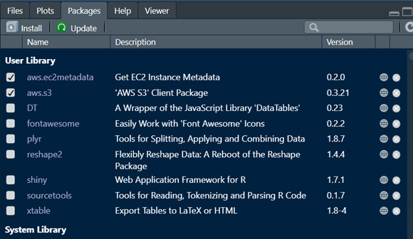
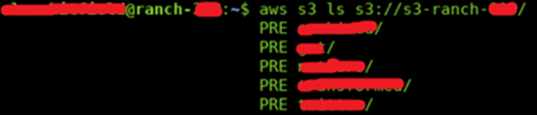

## Troubleshooting Problems Loading/Writing data to S3

If you encounter the error:

```         
Error in parse_aws_s3_response(r, Sig, verbose = verbose)
Moved Permanently (HTTP 301).
```

While using functions from the “aws.s3” package such as “aws.s3::s3read_using()“

1.  Ensure that the following package is installed:

    ```         
    install.packages("aws.ec2metadata")
    library(aws.ec2metadata)
    ```

    You can check this in the bottom right under the packages tab:

    

    to ensure you install to a share library you need to specify the location of the shared library like so:

    `install.packages("aws.ec2metadata", lib = "/home/R_package_lib")`

2.  Also check that the packages `aws.signature` and `aws.s3` are also installed.

    Run the following code:

    `Sys.setenv("AWS_DEFAULT_REGION" = 'eu-west-1')`

3.  If there are still issues with the package accessing the data, check the Virtual machine can access the Ranch bucket you need to pull data from.

    You can do this from the Linux Console with a command like this (Replace the XXX with the relevant bucket’s ranch number):

    `aws s3 ls s3://s3-ranch-XXX/`

    If the output shows you a list of folder names, the VM has access, eg:

    

4. If step 3 shows you there is no access, request that your VM be given read/Write access to the relevant buckets on the SCE Slack server. You will need the owner of the VM and the Buckets to approve the request.
